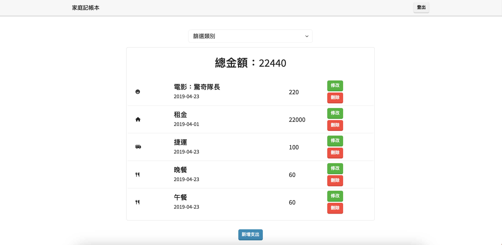
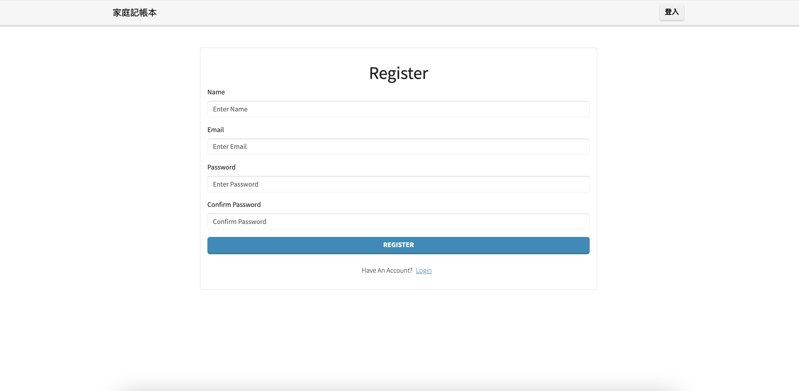
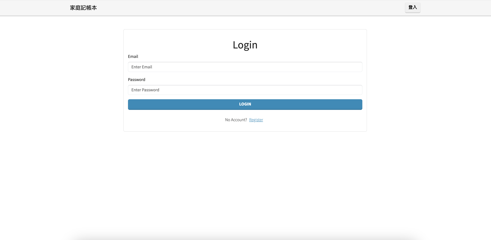

# Expense Tracker Website



This Expense Tracker website is designed to help you keep track of your expense activity and achieve your financial goal. It is built using Node.js, Express, and MongoDB, providing features including account creation, sign-in and sign-out functionalities, and CRUD (Create, Read, Update, Delete) operations for personal expenses.

## Features


- Register
  - User registration through email and password.
  - Warning message for missing required fields during registration.
  - Password mismatch warning during registration. 
  - Warning message for signing up the same email.
  - Register message available upon successful register an account. 


- Sign-in features 
  - Prompts for sign-in before accessing the main pages. 
  - Warning messages for attempting to sign in without input.
  - Sign in using an email that does not exist
  - Sign in with wrong password

- Sign out
  - Sign-out message available upon successful sign out.

- CRUD functionality
  - Browse all listed expenses.
  - Create new expense listings
  - Edit an expense.
  - Delete an expense.
  - Filter feature for expense listings based on category.

## Environment Setup

To run the project, make sure you have Node.js installed on your system. Then, follow these steps:

1. Make sure you have Node.js and npm installed on your system.
2. Clone the repository:
```
git clone https://github.com/anniehuang0410/expense-tracker.git
```
3. Navigate to the project directory: 
```
cd expense-tracker
```
4. Install the necessary packages: 
```
npm install
```
5. Obtain the cluster information from MongoDB. 
6. Construct the .env file (use .env.example as a template). The required variables include:
```
MONGODB_URI=mongodb+srv://<Your Account Name >:<Your Password>@<Your Cluster>/expense-tracker?retryWrites=true&w=majority
SESSION_SECRET=ThisIsMySecret
PORT=3000
```
 
7. Import the default user and restaurant seed data into your MongoDB database.
```
npm run seed
```
8. The email and password for testing purpose.
    ||Name|Email|Password|
    |:--|:--|:--|:--|
    |1|user1|user1@example.com|12345678|
   
10. Seeder data 
    ||Name|Date|Amount|
    |:--|:--|:--|:--|
    |1|午餐|2019.4.23|60|
    |2|晚餐|2019.4.23|60|
    |3|捷運|2019.4.23|120|
    |4|電影：驚奇隊長|2019.4.23|220|
    |5|租金|2019.4.01|22000|

11. Start the server: 
```
npm run start
```
11. Open your web browser and visit: 
```
http://localhost:3000
```
12. To exit the application and stop the server: 
```
ctrl + c
```

## Environment SetUp

- bcryptjs: 2.4.3
- body-parser: 1.20.2
- connect-flash: 0.1.1
- dotenv: 16.3.1
- express: 4.18.2
- express-handlebars: 7.0.7
- express-session: 1.17.3
- method-override: 3.0.0
- mongoose: 7.3.4
- passport: 0.6.0
- passport-facebook: 3.0.0
- passport-github2: 0.1.12
- passport-google-oauth20: 2.0.0
- passport-local: 1.0.0


## Developer

This project was developed by [Annie Huang](https://github.com/anniehuang0410).
